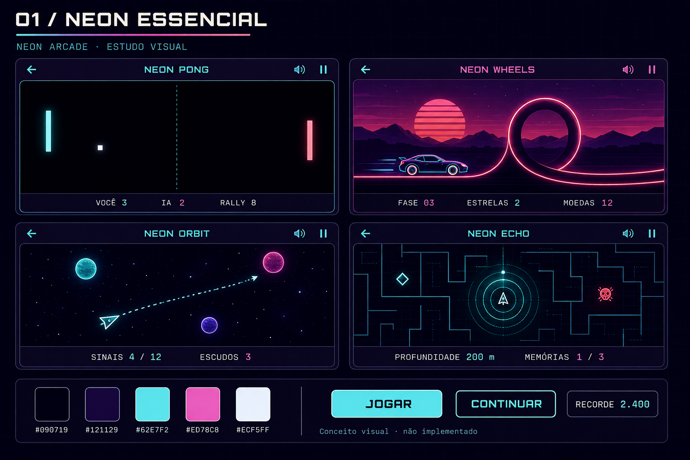
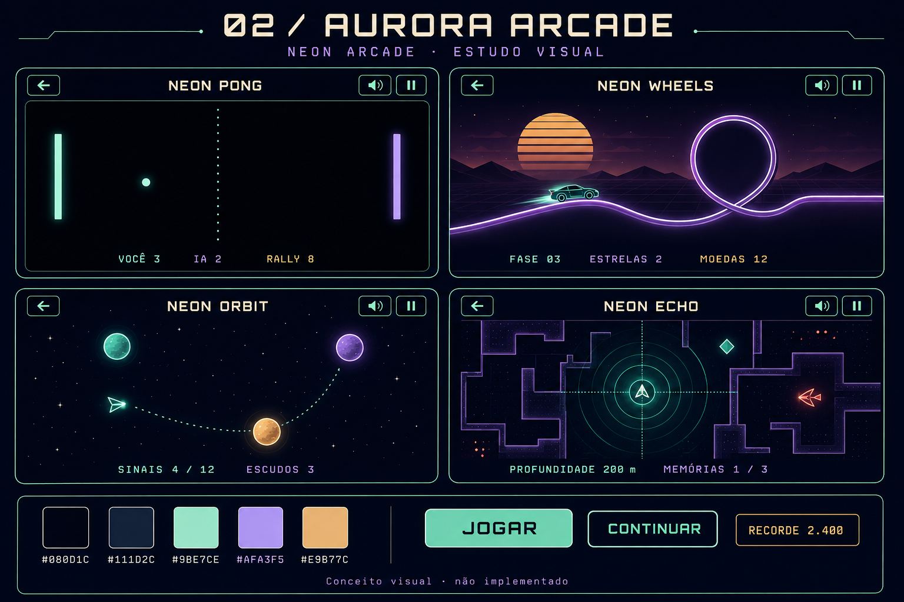
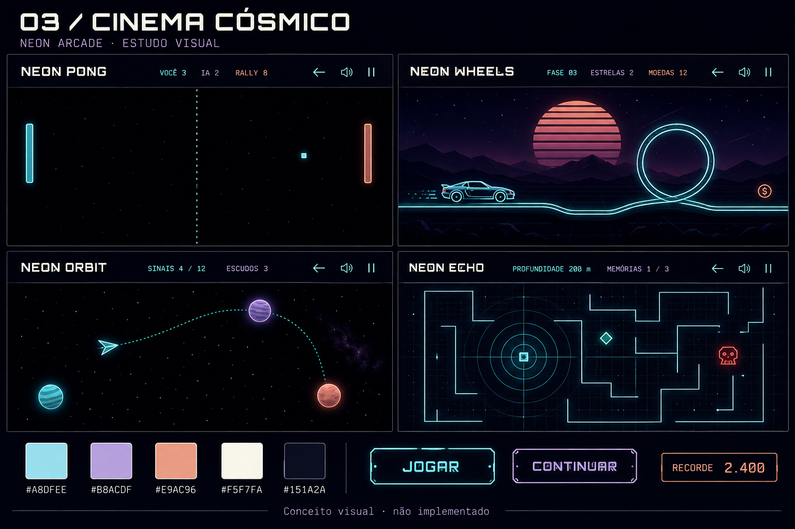
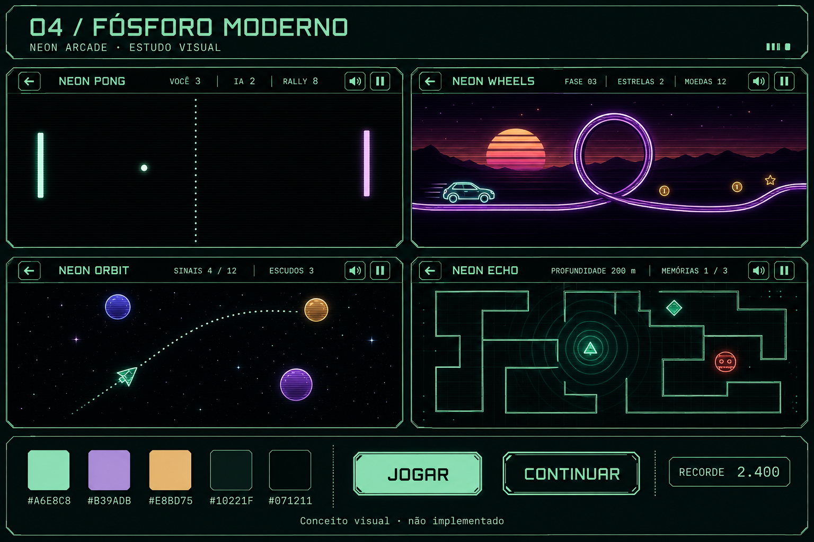
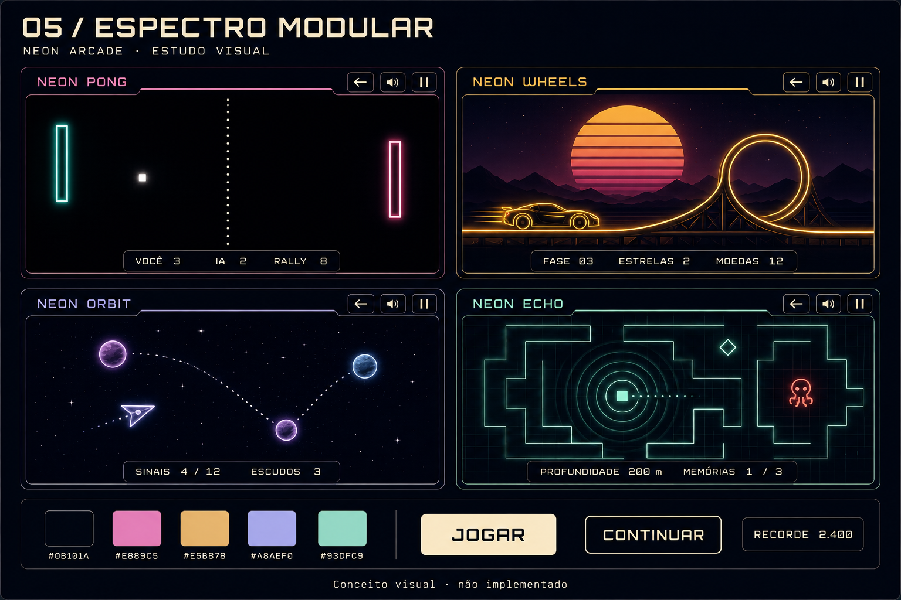

# Cinco propostas para o Neon Arcade

Estudos visuais gerados por IA para aprovação. Não são telas implementadas. Cada prancha compara Pong, Wheels, Orbit e Echo; não representa uma tela com quatro jogos simultâneos. As formas detalhadas e os valores do placar são ilustrativos.

Recomendação: **02 — Aurora Arcade**, pelo equilíbrio entre menta/azul dos jogos novos e lavanda/calor do arcade original.

[Plano de migração e critérios de aceite](plano.md) · [Prompts completos](prompts.md)

## 01 — Neon Essencial

A evolução mais conservadora: mantém ciano, rosa e violeta, com menos excesso de brilho.

## 02 — Aurora Arcade

Azul profundo, menta, lavanda e âmbar. O ponto de equilíbrio recomendado.

## 03 — Cinema Cósmico

Mais espaço para o cenário, títulos claros e molduras discretas. Aproxima os antigos da apresentação de Orbit/Echo.

## 04 — Fósforo Moderno

Traços técnicos, menta e âmbar com contraste violeta. Reinterpreta o neon como luz de instrumentos.

## 05 — Espectro Modular

Interface neutra consistente e uma cor de destaque para cada jogo. Mantém mais variedade na coleção.

Para fechar a direção, basta indicar o número preferido e eventuais combinações: por exemplo, paleta da 02 com a variedade por jogo da 05. A etapa seguinte é um piloto real no menu e nos quatro jogos de referência, antes da migração completa.
